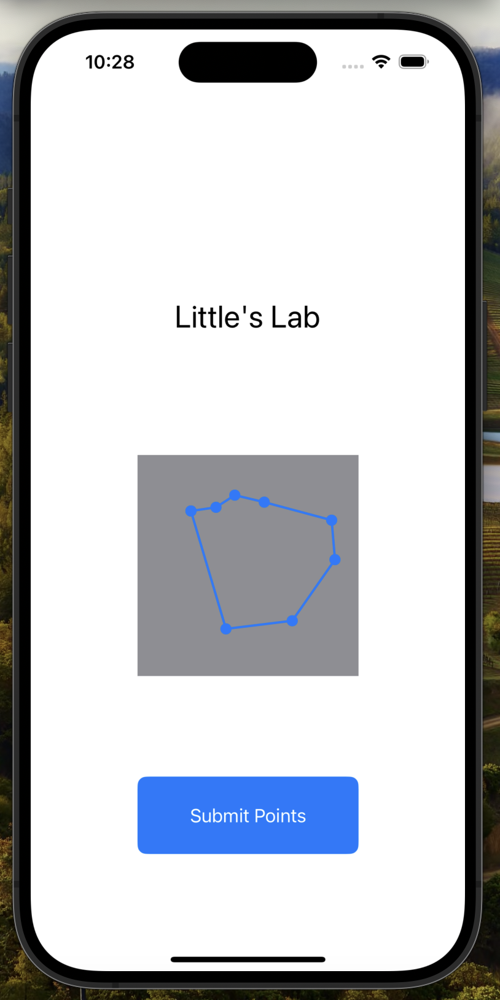

# Waypoints-Project

This project is an iphone application that simulates placeing waypoints for a robot to follow

The paths are continous which means the start point is also the end point

To delete a point, simply click an existing point and the point will be deleted.

If you delete a start/finish point, the program will assign a new start/endpoint to the next waypoint.

A demo video can be found [here](https://drive.google.com/file/d/1ljYGHyY6fW9qdr2pXhv2zUHFwx_UMG52/view?usp=sharing)

<!--  -->

